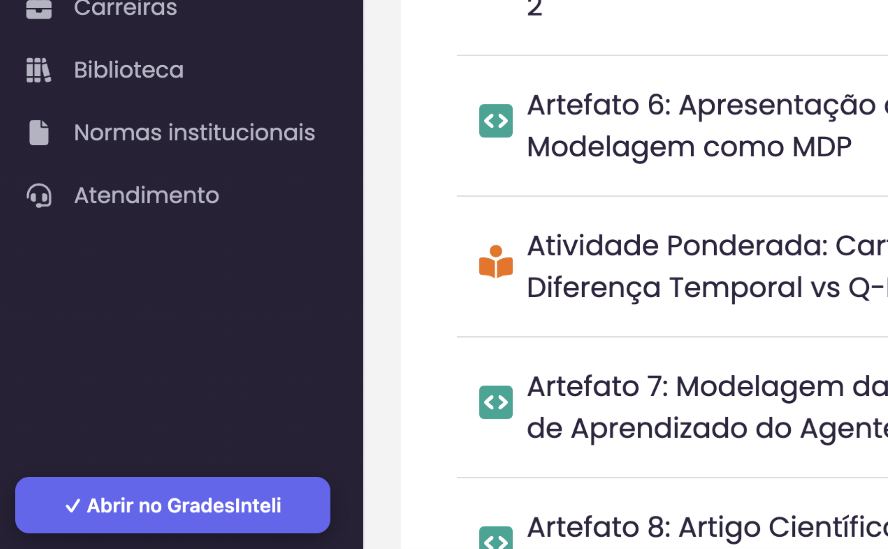
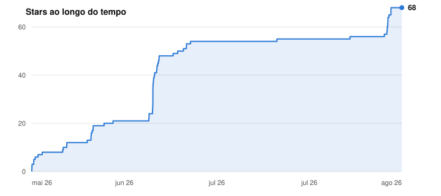

# Grades Inteli ⭐

**Uma plataforma open source para os alunos do Inteli nunca mais serem pegos de surpresa nas notas.**

Importa o HTML do Adalove, calcula tudo automaticamente e mostra exatamente o que você precisa tirar na prova pra passar. Simples assim.

---

## Por que isso existe?

Porque nenhum aluno deveria reprovar por falta de visibilidade. A famosa [planilha de notas](https://docs.google.com/spreadsheets/d/1PmS8W2Wg32J6AM097Om1dvlKDnFfx0FmIF6EjEY7H7E/edit?usp=sharing) ajudou muita gente, mas dava trabalho demais. Esse projeto automatiza tudo e transforma os dados em um dashboard que faz sentido.

**Grades Inteli é patrimônio dos alunos.** Código aberto, sem login, sem coleta de dados. Roda 100% no seu browser.

## O que faz

- **Importação direta do Adalove** — pela extensão do navegador (um clique) ou salvando a página de notas como HTML e fazendo upload.
- **Cálculo automático** — acumulado por categoria, média até o momento, nota necessária na prova.
- **Simulação** — escolhe uma nota alvo e vê em tempo real o que precisa acontecer.
- **Faltas** — importa presenças do Adalove e calcula quantas faltas ainda cabem no limite de 20%.
- **Participação** — seleciona sua categoria (A-E) e vê o impacto real no resultado final.
- **Persistência local** — tudo fica salvo no localStorage do seu browser. Fecha e abre de novo, tá tudo lá.
- **Tema claro/escuro** — porque cada um tem seu estilo.

## Como usar

A forma mais fácil é pela **extensão do navegador** — importa suas notas e faltas com um clique, sem salvar página nem fazer upload de arquivo.

[**📥 Baixe a extensão na Chrome Web Store**](https://chromewebstore.google.com/detail/adalove-%E2%86%92-gradesinteli/dpgoggjeajlgbkfabfhijccjfbchojpn)

1. Instale a extensão pelo link acima
2. No Adalove, abra a aba **Notas** (Acadêmico → Vida Acadêmica → Notas) e espere as atividades carregarem
3. Clique no botão **"✓ Abrir no GradesInteli"** que aparece no canto — o dashboard abre já preenchido

<p align="center">
  
</p>

**Como funciona:** quando você abre suas notas, o Adalove já busca os dados na API dele. A extensão apenas *observa* essa resposta (usando a sua própria sessão), guarda no `chrome.storage` local e entrega direto ao GradesInteli via `postMessage`. Não mexe no seu token, não faz login por você e não manda nada para servidores de terceiros. Mais detalhes em [`extension/README.md`](extension/README.md).

<details>
<summary><b>Sem a extensão?</b> Importar via HTML (Ctrl+S / Cmd+S)</summary>

<br>

1. Acesse o [site](https://gradesinteli.vercel.app)
2. No Adalove, vá em suas notas e salve a página completa (Ctrl+S / Cmd+S)
3. Clique em "Importar Adalove" e selecione o arquivo `.html`
4. Pronto — suas notas aparecem no dashboard

</details>

<details>
<summary>Instalar a extensão em modo desenvolvedor</summary>

<br>

1. Abra `chrome://extensions` (ou `edge://extensions`)
2. Ative o **Modo do desenvolvedor**
3. **Carregar sem compactação** / **Load unpacked** → selecione a pasta `extension/`

</details>

## Star History

<a href="https://github.com/henriquegpb/GradesInteli/stargazers">
 <picture>
   <source media="(prefers-color-scheme: dark)" srcset="assets/img/star-history-dark.svg" />
   <source media="(prefers-color-scheme: light)" srcset="assets/img/star-history-light.svg" />
   
 </picture>
</a>

## Rodando localmente

```bash
git clone https://github.com/henriquegpb/GradesInteli.git
cd GradesInteli
npm install
npm run dev
```

Acesse `http://localhost:3000`

## Stack

- **Next.js** com export estático (zero backend)
- **TypeScript**
- **CSS puro** (CSS Modules)
- **localStorage** para persistência
- **Lucide React** para ícones

## Contribuindo

O projeto é dos alunos, para os alunos. Se quiser melhorar alguma coisa:

1. Fork o repositório
2. Cria uma branch (`git checkout -b minha-feature`)
3. Commit suas mudanças
4. Abre um PR

Toda contribuição é bem-vinda — de correção de bug a feature nova.

## Licença

MIT — use, modifique, distribua. Só não vende como se fosse seu.

---

Feito com Redbull e desespero por [Henrique Barone](https://github.com/henriquegpb).
Inspirado na famosa [planilha](https://docs.google.com/spreadsheets/d/1PmS8W2Wg32J6AM097Om1dvlKDnFfx0FmIF6EjEY7H7E/edit?usp=sharing) que salvou muita gente.
